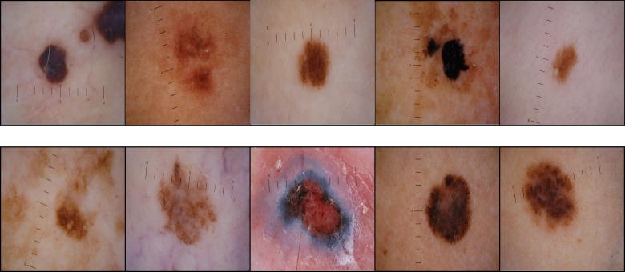
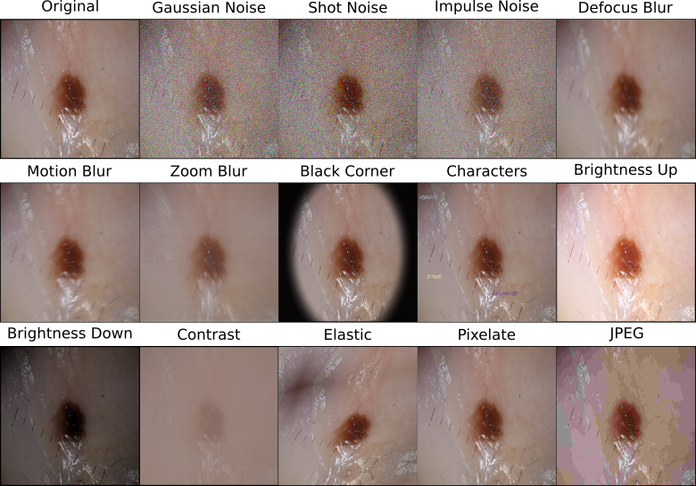

# Benchmarking Neural Network Robustness to Common Corruptions and Perturbations in Dermatology

This repository contains the datasets and code for the paper **A Benchmark for Neural Network Robustness in Skin Cancer Classification**. The study was heavily inspired and adapted from [Benchmarking Neural Network Robustness to Common Corruptions and Perturbations](https://arxiv.org/abs/1903.12261) (ICLR 2019) by Dan Hendrycks and Thomas Dietterich ([GitHub](https://github.com/hendrycks/robustness)).

## Table of Contents
  1. [Overview](#overview)
  2. [SAM](#sam)
  3. [SAM-C](#sam-c)
  4. [SAM-P](#sam-p)
  5. [Results](#results)
  6. [Submission](#submission)
  8. [Evaluation](#evaluation)
  9. [Condensed Workflow](#condensed-workflow)
  10. [Citation](#citation)

## Overview

This benchmark contains previously unpublished dermoscopic melanoma and nevus images and is designed to test skin lesion classifiers on out-of-distribution (OOD) data. Images are available for download, albeit without ground truth labels in order to maintain the OOD nature of the benchmark. The benchmark consists of three datasets:
 
  1. **SAM**: contains unmodified dermoscopic images which can be used to establish a classifier's performance on clean images.
  2. **SAM-C**: contains corrupted dermoscopic images derived from SAM. This dataset can be used to establish a classifier's robustness to low-quality inputs (e.g. blurry, obstructed or distorted images).
  3. **SAM-P**: contains perturbed dermoscopic images derived from SAM. This dataset can be used to establish a classifier's robustness to subtle, repeated image changes (e.g. continuous change of brightness).
 
All images have a resolution of 1000x667 pixels. For this benchmark, reference classifiers were trained and evaluated with rescaled images (i.e. 448x448 pixels). Therefore, any direct comparisons should also use a resolution of 448x448 pixels. Classifier training should also be carried out without any of the data augmentations that were used to create SAM-C and SAM-P (i.e. no rotations, tilts, gaussian noise, etc.). If there is an augmentation overlap, it should be explicitly stated.

## SAM

SAM (Skin Archive Munich) contains 85 unique lesions. Of these 37 are classified as melanoma and 48 as nevus. As each lesion was photographed multiple times with different camera angles and magnifications, the total number of images in the dataset increases to 319, of which 194 are melanoma and 125 are nevus.

[Download SAM here \[<1 GB\].](https://s3.dkfz.de/HD02-HBA-Benchmark/SAM.7z)

## SAM-C

SAM-C is derived from SAM by corrupting its images using 14 corruption types drawn from four main categories - noise, blur, dermoscopy and digital - and five different severity levels. This results in an effective dataset size 22,330 of images.

[Download SAM-C here \[21 GB\].](https://s3.dkfz.de/HD02-HBA-Benchmark/SAM-C.7z)

## SAM-P

SAM-P is derived from SAM by perturbing its images using 10 corruption types drawn from four main categories - noise, blur, dermoscopy and digital. Each image from SAM is perturbed 31 times, resulting in perturbation sequences similar to the ones shown below. This results in an effective dataset size of 98,890 images. In addition to the PNGs, we also provide an MP4 version of SAM-P for illustration, where each perturbation sequence is converted into a short video of 31 frames.    

   

[Download SAM-P here \[106 GB\].](https://s3.dkfz.de/HD02-HBA-Benchmark/SAM-P.7z)

[Download MP4 version of SAM-P here \[17 GB\].](https://s3.dkfz.de/HD02-HBA-Benchmark/SAM-P_MP4.7z)

## Results

We provide the full corruption and perturbation results for all architectures broken down for each transformation type and averaged across all five repetitions. For [SAM-C](https://docs.google.com/spreadsheets/d/1Qo52dAkE55bR6AZTOBdJmI-VYn_XtxlR_kePeHihe3Y/edit?usp=sharing) we show both the *mCBE* (sheet 1) and *relative mCBE* (sheet 2). For [SAM-P](https://docs.google.com/spreadsheets/d/1bx8h27CFBtzQkDnW3ltXAjzCMJSRKC4tcIZaDgK10dw/edit?usp=sharing) we show the *mFR*. In each spreadsheet, Table 1 shows the unadjusted results while Table 2 shows the results that were adjusted by our AlexNet baseline.  

## Submission

Researchers who decide to use this benchmark should submit their results via email to <roman.maron@nct-heidelberg.de> and reference 'Robustness Benchmark Submission' in the subject line. Submission file templates are available [here](https://s3.dkfz.de/HD02-HBA-Benchmark/SubmissionTemplates.7z). The name for each submission file must adhere to the following pattern:

`[CustomText]_DatasetName.csv`

where `CustomText` can be anything except underscore. `DatasetName` is fixed to either SAM, SAM-C, SAM-P, SAM-C-Extra or SAM-P-Extra and should not be changed. For example, a researcher could submit a set of files named `MyApproachA_SAM.csv`, `MyApproachA_SAM-C.csv` and `MyApproachA_SAM-P.csv` to obtain results for SAM, SAM-C and SAM-P for his/her approach A.

### Submission File Format

Each submission file is a single CSV (comma-separated value) file, with three columns: `image_path`, `nevus`and `melanoma`. Column `image_path` is already prefilled and should not be changed. Columns  `nevus`and `melanoma` require the researcher to fill in the respective diagnostic confidence scores which are expressed as a floating-point values in the closed interval [0.0, 1.0], where 0.5 is used as the binary classification threshold.

## Evaluation

Evaluation of the submitted files is carried out by us using the metrics for SAM, SAM-C and SAM-P that were outlined in the paper. For each submitted file, we will provide a corresponding csv file that will list the unadjusted metrics for each transformation. Researchers can then calculate the unadjusted *mCBE*, *relative mCBE* and *mFR*, as well as the [baseline](https://s3.dkfz.de/HD02-HBA-Benchmark/Baseline.7z) adjusted *mCBE*, *relative mCBE* and *mFR*.  We have provided an exemplary notebook and the necessary code to do so in this repo. 

## Condensed Workflow

1. Download and extract [SAM](https://s3.dkfz.de/HD02-HBA-Benchmark/SAM.7z), [SAM-C](https://s3.dkfz.de/HD02-HBA-Benchmark/SAM-C.7z) and [SAM-P](https://s3.dkfz.de/HD02-HBA-Benchmark/SAM-P.7z). 
2. Download [submission file templates](https://s3.dkfz.de/HD02-HBA-Benchmark/SubmissionTemplates.7z) and rename `CustomText` to anything except underscore.
3. Evaluate your classifier and fill in templates with your obtained diagnostic confidence scores.
4. Send submission templates via email to <roman.maron@nct-heidelberg.de>, referencing 'Robustness Benchmark Submission' in the headline.
5. Receive results and calculate the unadjusted and adjusted metrics using our [AlexNet baseline](https://s3.dkfz.de/HD02-HBA-Benchmark/Baseline.7z) and provided code. 

## Citation

If you use this benchmark in your research, please cite:

  *TODO*

